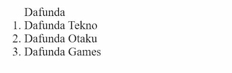

# **Rangkuman Week1**

## Unix Commad Line

- ### CLI (Command Line Interface)
  <div align="justify">Merupakan sebuah program yang memungkinkan user mengetik perintah atau command yang akan mmemerintahkan perangkat komputer untuk melakukan suatu tugas tertentu.
- ### Shell
  <div align="justify">Agar bisa terhubung dengan komputer maka user akan memerlukan penerjemah. Maka dari itu user memerlukan yang namanya shell. Definisi shell secara harfiah sendiri adalah program yang digunakan untuk berkomunikasi atau memerintah sistem.
- ### Terminal
  <div align="justify">User dan komputer dihubungkan dengan namanya terminal, yaitu tempat/aplikasi dimana user dapat mengetikan atau memberikan suatu perintah. Disinilah tempat dimana shell akan berperan.
- ### File System Structure

  <div align="justify">Struktur dimana mengatur cara bagaimana data disimpan dalam sistem. Contoh dalam Sistem Operasi Windows struktur file yang disimpan menggunakan struktur yang bentuknya mirip sebuah pohon seperti gambar dibawah.

  &nbsp;

  

- ### Command

  - pwd (print working directory), untuk melihat current working directory
  - dir (directory), untuk melihat directory
  - cd (change directory), untuk pindah directory
  - ls (list), untuk melihat isi file di dalam directory
  - touch, untuk membuat file directory
  - cp (copy), untuk menyalin file directory
  - mv (move), untuk memindahkan file directory
  - rm (remove), untuk menghapus file directory

  &nbsp;

## Git & Github

- ### Apa itu Git & Github

  - Git
    <div align="justify">Merupakan aplikasi yang dapat melacaks suatu perubahan yang terjadi di suatu folder ataupun file, yang biasanya digunakan oleh programmer sebagai tempat untuk menyimpan file programan mereka karena lebih efektif.

  - Github
    <div align="justify">Merupakan vendor penyedia layanan git yang dimiliki oleh microsoft atau secara definisi merupakan layanan hosting berbasis web sebagai repositori git.

  &nbsp;

  ### Mengapa wajib menggunakan Git & Github?

  <div align="justify">Alasan utamanya adalah sepandai apapun programmer, tidak akan mampu untuk mengerjakan semuanya sendiri selamanya. Maka dari itu dengan menggunakan Git & Github akan memudahkan programmer untuk bisa bekerja sama dalam sebuah tim. Tujuan besarnya adalah programmer bisa berkolaborasi dengan programmer lainnya dengan mengerjakan proyek yang sama tanpa harus repot copy paste folder aplikasi yang terupdate.

&nbsp;

- ### Command di dalam Git & Github

  - git init <nama_proyek>, untuk membuat repositori baru

    

  - <div align="justify">git commit, untuk melakukan commit atau menyimpan perubahan pada version control pada git. Dan kita bisa menambahkan pesan untuk membeikan checkout pada setiap perbuahan. contohnya "git commit -m "pesan checkout"

    .jpg>)

  - git push origin, untuk mempublish file atau aplikasi ke github

    

  - git clone, untuk melakukan cloning dari github ke komputer atau local

    .JPG>)

## HTML

- Definisi HTML

  <div align="justify">Merupakan bahasa komputer yang digunakan untuk membuat kerangka atau struktur untuk Web pages (halaman website) di internet. Bagaimana peran HTML pada web development? Web browser seperti Chrome, Firefox, Edge, Safari, atau Opera akan membaca dokumen HTML. Dokumen HTML yang berisi tag-tag HTML akan memberitahu browser bagaimana cara menampilkan sebuah konten.

&nbsp;

- Kerangka HTML

  HTML memiliki sebuah kerangka seperti gambar dibawah ini

  ```html
  <html>
  <head>
  <title>
      Judul Website
    </title>
  <body>
      saya sedang belajar pemrograman HTML dasar.
    </body>
  </html>
  ```

    <div align="justify">Sintak diatas biasa disebut dengan kerangka bahasa pemrograman HTML. Didalam website selalu ada title untuk tiap-tiap web, untuk memasukkan title didalam web kamu harus mengetikkan diantara tag title (dapat diisikan dengan nama website kamu atau yang lainnya). Untuk memasukkan konten-konten, kamu dapat memasukkannya atau mengetikkannya didalam program tepat diantara tag body (Ganti titik-titik dengan konten).

  &nbsp;

- Tag HTML

  <div align="justify">Tag adalah sebauh penanda awalan dan akhiran dari sebuah elemen di HTML. Tag dibuat dengan kurung siku (<...>), lalu di dalamnya berisi nama tag dan kadang juga ditambahkan dengan atribut.

  Tag selalu ditulis berpasangan. Ada tag pembuka dan ada tag penutupnya. Namun, ada juga beberapa tag yang tidak memiliki pasangan penutup. Tag penutup ditulis dengan menambahkan garis miring (/) di depan nama tag.

  &nbsp;

  Contoh tag HTML

  - Tag untuk membuat tulisan tebal dan miring

    ```html
    <b>Tebal</b> <i>Miring</i>
    ```

    Hasilnya di browser

    

  - Tag HTML Untuk Membuat tulisan dengan link

    ```html
    <a href="">Welcome To AMMAN Coding Bootcamp BATCH 3</a>
    ```

    Hasilnya di web browser

    

  - Tag Untuk Membuat Daftar/List

    - Ordered List

      ```html
      <ol>
        Dafunda
        <li>Dafunda Tekno</li>
        <li>Dafunda Otaku</li>
        <li>Dafunda Games</li>
      </ol>
      ```

      Hasilnya di web browser

      

    - Ordered List

      ```html
      <ul>
        Dafunda
        <li>Dafunda Tekno</li>
        <li>Dafunda Otaku</li>
        <li>Dafunda Games</li>
      </ul>
      ```

      Hasilnya di web browser

      

  - Tag HTML Untuk Membuat tulisan dengan link

    ```html
    </img>
    ```

    Hasilnya di web browser

    

    &nbsp;

- Deploy HTML

  <div align="justify">Deploy adalah sebuah proses untuk menyebarkan aplikasi yang sudah kita kerjakan supaya bisa digunakan oleh orang-orang. Jika aplikasi kita HTML atau Web App kita perlu mendeploy ke server. Untuk melakukan hal tersebut kita bisa menggunakan layanan yang bernama Netlify

## CSS

- Definisi CSS

  <div align="justify">CSS adalah bahasa komputer yang digunakan untuk menambahkan design ke suatu halaman website di internet agar terlihat lebih cantik/menarik. CSS adalah singkatan dari Cascading Style Sheets. Kita ibaratkan HTML adalah kerangka yang memberi sturuktur pada website, maka CSS adalah baju yang memberi warna dan layout pada website.

&nbsp;

- Cara Menggunakan CSS

  1. Inline Styles

     Kita menambahkann CSS langsung pada atribut HTML

     ```html
     <p style="color:red">Tulisan ini berwarna merah</p>
     ```

     

  &nbsp;

  2. Internal CSS

     Kita menggunakan element/tag `<style>` untuk menyisipkan kode CSS. element/tag `<style>` diletakkan di dalam element `<head>`

     ```html
     <!DOCTYPE html>
     <html>
       <head>
         <title>Website Pertamaku</title>
         <style>
           body {
             background-color: yellow;
           }
           h1 {
             color: blue;
           }
           p {
             color: red;
           }
         </style>
       </head>
       <body>
         <h1>Website Pertamaku</h1>
         <p>Selamat Datang</p>
       </body>
     </html>
     ```

     Tampilan dari sintaks diatas adalah

     

     &nbsp;

  3. Eksternal CSS

     Kita akan menyisipkan kode CSS dengan cara membuat file CSS terpisah, dan lalu menyambungkannya dengan file HTML dengan menggunakan element <link>. Element <link> tersebut diletakkan di dalam element <head>

     Contoh:

     Kita memiliki dua file: index.html untuk file HTML-nya dan styles.css untuk file CSS-nya.

     ```html
     <!-- File index.html -->

     <!DOCTYPE html>
     <html>
       <head>
         <title>Website Pertamaku</title>
         <link rel="stylesheet" href="styles.css" />
       </head>
       <body>
         <h1>Website Pertamaku</h1>
         <p>Selamat Datang</p>
       </body>
     </html>
     ```

     ```css
     /* File styles.css */

     body {
       background-color: pink;
     }
     h1 {
       color: blue;
     }
     p {
       color: black;
     }
     ```

     Tampilan dari sintaks diatas adalah

     

  4. CSS Syntax

     CSS Syntax adalah syntax yang digunakan untuk menunjuk atau memilih HTML element mana yang ingin diberi style (dihias). CSS syntax terdiri dari selector, property, dan value.

     Syntaxnya seperti ini:

     ```css
     p {
       color: blue;
     }
     ```

     Penjelasan :

     - p

       Adalah sebuah selector berupa element HTML yang akan diubah

     - color

       Adalah sebuah properti berupa bagian mana dari element HTML yang akan diubah. Contoh diatas kita akan mengubah warna dari teks yang ada di element p

     - blue

       Adalah value yaitu nilai/hiasan berupa warna biru

     &nbsp;
